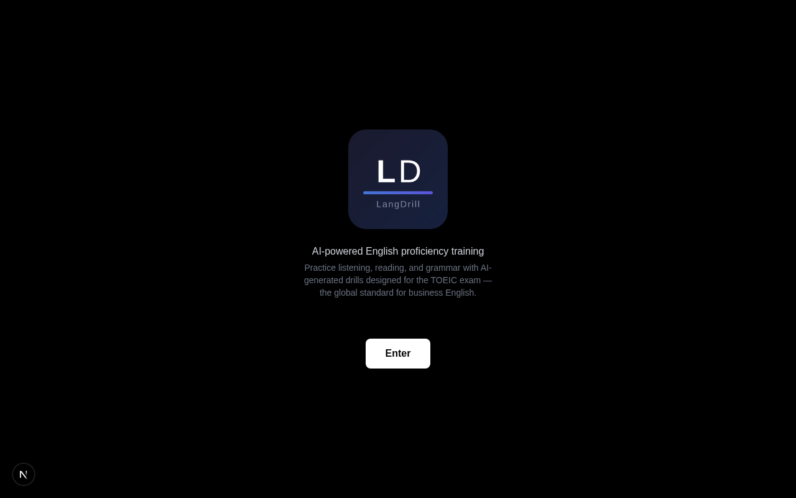
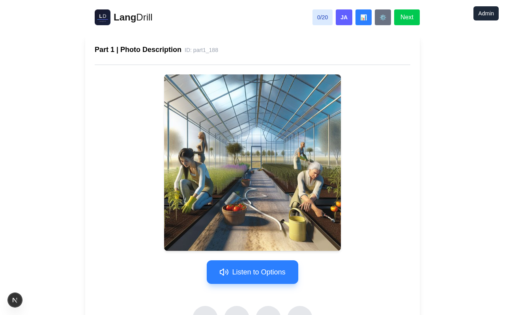
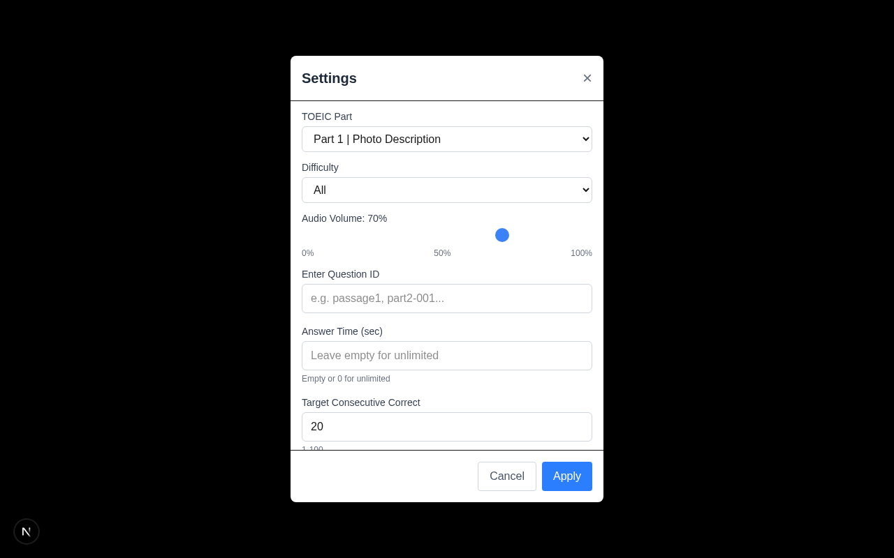
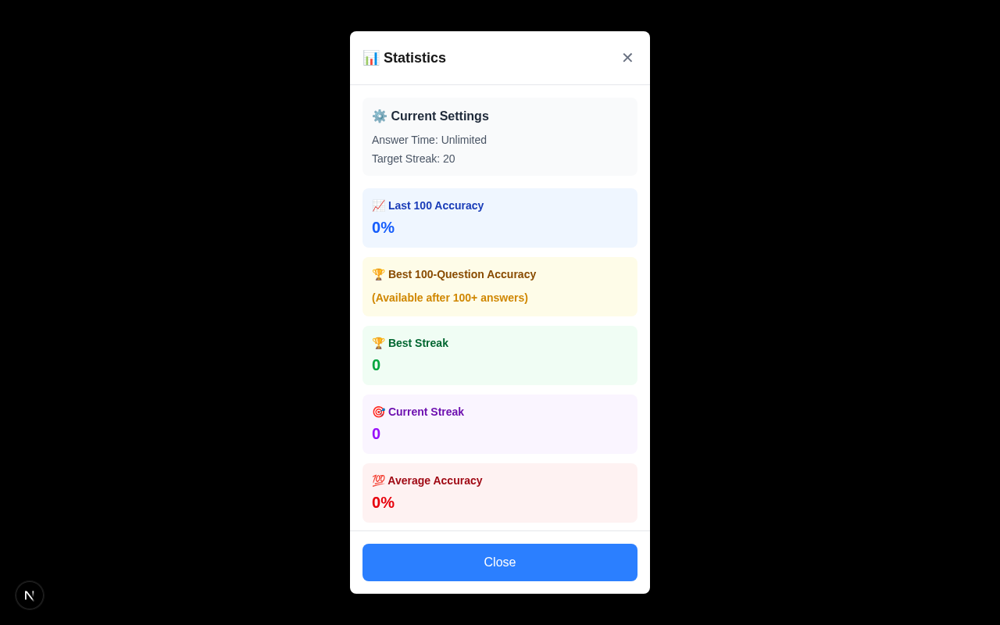
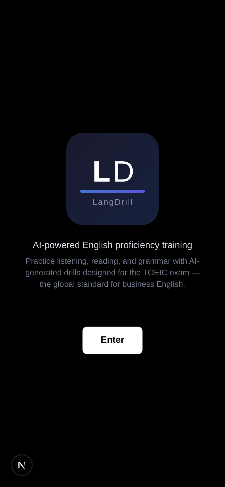
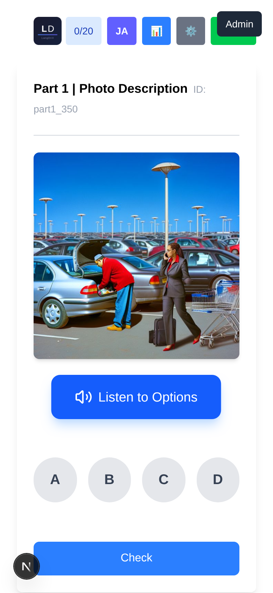

# LangDrill

<!-- CI badge: update URL after migrating to work account -->
<!-- [](https://github.com/YOUR_ACCOUNT/YOUR_REPO/actions/workflows/ci.yml) -->

**AI-powered English proficiency training for the TOEIC exam.**

Practice listening, reading, and grammar with 1,400+ AI-generated questions covering all 7 TOEIC parts. Built with Next.js 15, TypeScript, and GPT-4o.

<!-- Live Demo: update URL after migrating to work account -->
<!-- **[Live Demo](https://YOUR_APP.vercel.app/)** -->

---

## Screenshots

<table>
  <tr>
    <td align="center"><strong>Splash Screen</strong></td>
    <td align="center"><strong>Part 1 - Photo Description</strong></td>
  </tr>
  <tr>
    <td></td>
    <td></td>
  </tr>
  <tr>
    <td align="center"><strong>Settings</strong></td>
    <td align="center"><strong>Statistics</strong></td>
  </tr>
  <tr>
    <td></td>
    <td></td>
  </tr>
  <tr>
    <td align="center" colspan="2"><strong>Mobile View</strong></td>
  </tr>
  <tr>
    <td align="center"></td>
    <td align="center"></td>
  </tr>
</table>

## Features

- **Full TOEIC Coverage** - All 7 parts of the TOEIC test, from photo descriptions to multi-passage reading
- **1,400+ Questions** - AI-generated with difficulty levels (Easy / Medium / Hard)
- **Audio Playback** - ElevenLabs TTS voices with adjustable volume and fallback to browser speech
- **Bilingual UI** - English / Japanese toggle for all interface elements
- **Progress Tracking** - Accuracy stats, streak counter, best scores stored locally
- **PWA** - Installable on mobile, works offline
- **Responsive Design** - Mobile-first, optimized for phones and tablets

## Question Database

| Part | Type | Questions | Audio |
|------|------|-----------|-------|
| Part 0 | Listening Foundation | 132 sentences | ElevenLabs TTS |
| Part 1 | Photo Description | 137 questions | AI-generated images + audio |
| Part 2 | Question-Response | 109 questions | Multi-voice audio |
| Part 3 | Conversations | 159 questions | Multi-speaker dialogues |
| Part 4 | Talks | 182 questions | Long-form audio |
| Part 5 | Incomplete Sentences | 148 questions | - |
| Part 6 | Text Completion | 21 questions | - |
| Part 7 | Reading Comprehension | 181 passages (543 questions) | - |

All content is AI-generated using GPT-4o with Japanese translations included.

## Tech Stack

| Layer | Technology |
|-------|-----------|
| Framework | Next.js 15 (App Router) |
| Language | TypeScript (strict mode) |
| Styling | Tailwind CSS 4 |
| AI | OpenAI GPT-4o (translations, question generation) |
| Audio | ElevenLabs TTS, Web Speech API |
| Storage | Cloudflare R2 (audio), localStorage / IndexedDB (settings) |
| Deployment | Vercel |
| Testing | Playwright (E2E) |

## Architecture

```
src/
  app/           # Next.js App Router pages + 14 API routes
  components/    # React components (Part0-7, Stats, Settings)
  contexts/      # LanguageContext (i18n)
  data/          # JSON question databases (~10MB total)
  lib/           # Types, translations, utilities
  utils/         # Game settings, stats tracking

generator/       # Content generation pipeline
  scripts/       # GPT-4o question generators per part
  lib/           # OpenAI config, prompts, validators
```

### Key Design Decisions

- **No external i18n library** - Custom lightweight translation system (~160 keys) via React Context
- **No database** - All questions stored as JSON, loaded into memory at startup for instant navigation
- **Hybrid audio** - ElevenLabs for high-quality voices, browser TTS as fallback
- **Cloudflare R2** - Audio files served via CDN instead of bundling with the app

## Getting Started

```bash
npm install
npm run dev          # Starts on http://localhost:3001
```

### Scripts

```bash
npm run dev          # Development server (port 3001)
npm run build        # Production build
npm run lint         # ESLint check
npm start            # Production server
```

### Question Generation

Requires `OPENAI_API_KEY` environment variable.

```bash
cd generator/scripts/generate
node generate-passages-unified.js --difficulty=hard --count=5
```

## License

Private project.
